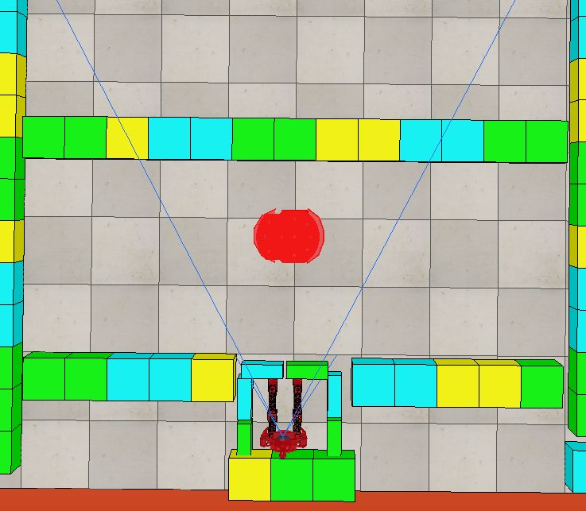
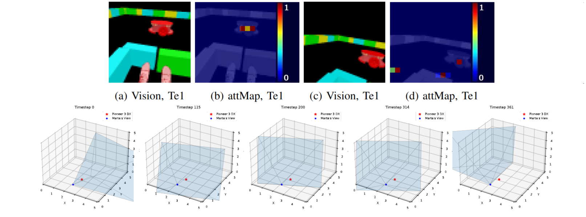

# Where Are My Toys Going? Exploring Incremental Learning in Object Tracking and Object Permanence

Repository for the code of the work submitted to IEEE International Conference on Development and Learning (ICDL-2025).

This project investigates **incremental cognitive development** in robotics by enabling a humanoid robot to acquire object tracking and object permanence skills in a structured, developmental manner inspired by **Piagetian psychology**.

Developed using the **Cognitive System Toolkit (CST)** and based on the **CONAIM cognitive architecture**, this project contributes to cognitive robotics by demonstrating how perceptual, attentional, motivational, and learning mechanisms can be progressively integrated into a robotic system to mimic aspects of infant learning.

---

## 🧠 Project Overview

### Objective
To explore how a robot can **incrementally learn to track objects**, infer their trajectories when occluded, and manage attention among multiple stimuli—skills akin to human infant cognitive development.

### Motivation
Much like how infants gradually develop an understanding of the world, this project aims to equip robots with similar cognitive mechanisms using a **phase-based developmental framework**. This includes:
- **Bottom-up and top-down attention**
- **Procedural memory**
- **Curiosity-driven motivation**
- **Deep Reinforcement Learning (DQN)**

---

## 🧩 Incremental Experiments

This work investigates the incremental learning of object tracking and the development of object permanence. The experiments consist of a series of structured robotic tasks inspired by Piaget’s developmental framework, in which an agent gradually acquires cognitive skills through active interaction with its environment. 

This incremental approach aligns with principles of infant cognitive development and provides a scalable framework for enhancing object tracking and permanence in autonomous robotic systems.

The experiments are divided into five phases, each progressively increasing in complexity. Each phase builds upon the previous one, ensuring that the agent develops skills incrementally over time. 

In the **first phase**, the agent learns to fixate its gaze on stationary objects within its field of view.

In the **second phase**, it acquires the ability to track objects moving at moderate speeds, but only while they remain within its field of view. 

In the **third phase**, the agent integrates head movement to follow objects that would otherwise leave its visual field, dynamically adjusting its gaze to maintain visual contact. These initial three phases correspond to object tracking learning, as the agent gradually refines its ability to follow moving objects as it acquires motor refined capabilities. 

Once object trajectory learning and tracking skills are in place, we introduce object occlusion in the **fourth phase**. This requires the agent to leverage two key abilities: tracking, to predict an object’s trajectory even when it is temporarily out of sight, and object permanence, which enables the agent to recognize that the object continues to exist despite being visually occluded.

Finally, in the **fifth phase**, the agent integrates these skills into a more complex scenario involving multiple objects. Here, the agent must distinguish and track two objects, prioritizing its focus on the currently moving object and shifting attention dynamically as the objects take turns in motion.


---

## 🧪 Methodology

### Architecture
The architecture evolves across **five developmental phases**, each adding new cognitive functions. s. Colored parallelograms indicate phase additions.

1. **Phase 1**: fundamental modules—including sensory, perceptual, attentional, learning, and motor components—without any parallelogram indicators. Additionally, it incorporates the Winner Picker (purple parallelogram), which employs a WTA algorithm, and the Learning module (green parallelogram), which at this stage does not perform fine-tuning.
2. **Phase 2**: motivational modules (red parallelogram) are introduced. Phase 3 further extends the architecture with top-down feature maps (yellow parallelogram).
3. **Phase 3**: Further extends the architecture with top-down feature maps (yellow parallelogram).
4. **Phase 4**: Procedural memory and trajectory prediction; object permanence. Involves fine-tuning, modifying the Learning module (green parallelogram)
5. **Phase 5**: Alternating attention mechanism for multiple object tracking.  The Winner-Takes-All algorithm in the Winner Picker is replaced with an alternative attention mechanism.


### Simulation Environment
- **Humanoid Robot**: Marta (1.1m tall, 25 DOF, RGB-D vision).
- **Interactive Objects**: Pioneer P3DX robots acting as toys.
- **Simulation**: All experiments run in **CoppeliaSim**, a high-fidelity robot simulator.
- Visual and attentional data processed using different resolutions at each phase to simulate infant visual development.

### Learning Mechanism
- Reinforcement learning via a **Deep Q-Network (DQN)** using RBF activation.
- Reward structure includes salience interaction, exploration, and actuator control success.
- Training across episodes and fine-tuning in later phases to handle occlusion and multi-object scenarios.

---

## 🧬 Experimental Phases

The project includes **training and testing experiments** that progressively challenge the robot:

| Phase | Cognitive Additions                  | Abilities Developed                         |
|-------|--------------------------------------|---------------------------------------------|
| 1     | Bottom-up attention                  | Gaze fixation on static objects             |
| 2     | Motivation system                    | Tracks moving objects in FOV                |
| 3     | Top-down attention                   | Tracks objects moving out of FOV            |
| 4     | Procedural memory, fine-tuning       | Predicts occluded object trajectories       |
| 5     | Alternating attention mechanism      | Multi-object tracking and attention shifting|

### Sample Experiments

**(i) Training Experiments** 

At the beginning of each new episode, Marta’s actuators are reset to their initial positions, and the position(s) of the Pioneer robot(s) are randomly assigned within the available space.

**Experiment Tr1:** A red Pioneer robot moves at an angular velocity of 2 rad/s within an open space in front of Marta, with blocks scattered throughout the environment. This setup is used during training for Experiments in Phases 1, 2, and 3. The objective is to assess the agent’s ability to incrementally develop Object Tracking capabilities.

<p align="center">

</p>

**Experiment Tr2:** A red Pioneer robot moves at 1 rad/s within a delimited space away from Marta, becoming occluded for a period of time. This setup is used during training for experiments in Phase 4. The objective is to develop the agent’s understanding of Object Permanence.

<p align="center">

</p>

**Experiment Tr3:** Two Pioneer robots, one red and one blue, move at an angular velocity of 2 rad/s within a delimited space away from Marta, both becoming occluded for a period of time. This setup is employed during training for experiments in Phase 5. The agent’s goal is to develop skills in Multiple Object Tracking and Object Permanence.

<p align="center">

</p>

**(ii) Testing Experiments**

 All testing experiments are conducted using the DQN model with the best parameters obtained during training. In the first test experiment, both Marta’s actuators and the Pioneer robot’s position are reset to their initial configurations. Starting from the second test experiment onward, at the beginning of each new episode: 
 - Marta’s actuators are reset to their initial positions;
 - The position(s) of the Pioneer robot(s) are randomly initialized within the available space; 
 - Additionally, whenever the Pioneer robot is set to move, its angular velocity is fixed at 2 rad/s. 
 
 Each experiment increases in complexity, requiring progressively more advanced cognitive modules for the agent
to successfully learn the intended ability. Starting from the second test experiment (Te2) onward, we evaluate both the current agent (trained with the appropriate modules) and the agent from the previous phase(s). This comparison is designed to demonstrate that the less developed agent, lacking the necessary cognitive components, is unable to solve the task.

**Experiment Te1:** A red Pioneer robot remains stationary in front of Marta, as illustrated in Figure 3d. In this experiment, the agent is expected to exhibit early stages of Object Tracking, as the robot responds reactively to salient stimuli through bottom-up attention, maintaining focus on the object within its field of view.

<p align="center">

</p>

**Experiment Te2:** A red Pioneer robot moves within a confined space in front of Marta, as shown in Figure 3e. Driven by curiosity-based motivation, a Phase 2 agent is encouraged to explore different states and actions, allowing it to search for the Pioneer even when it moves outside its field of view, enhancing Object Tracking capabilities. In contrast, a Phase 1 agent is unable to perform Te2 due to its purely reactive behavior, responding only to salient stimuli—typically stationary or slow-moving—within its limited field of vision.

<p align="center">

</p>

**Experiment Te3:** A red Pioneer robot moves within an open space in front of Marta, as shown in Figure 3d. With the capacity to employ top-down attention and define features of interest, a Phase 3 agent can determine whether its focus should be on near or distant objects in order to track objects.
In contrast, a Phase 2 agent is unable to perform Te3: although curiosity motivates it to seek new states, it lacks the attentional mechanisms to remain focused on the Pioneer once it moves
to the back of the environment.

<p align="center">

</p>

**Experiment Te4:** A red Pioneer robot moves within a delimited space, distancing itself from Marta and becoming occluded for a period of time, as illustrated in Figure 3b. The ability being explored is Object Permanence, which requires the cognitive functions available from at least Phase 4 to
succeed. To perform this experiment, a Phase 4 agent must be capable of predicting the Pioneer’s trajectory. For this purpose, finetuning is carried out using Experiment Tr2, enabling the
agent to develop procedural schemes tailored to this task. In contrast, a Phase 3 agent, lacking the ability to anticipate the robot’s path, fails to continue tracking the Pioneer once it
passes behind the wall.

<p align="center">

</p>

**Experiment Te5:** A red Pioneer robot moves within a confined space, distancing itself from Marta and becoming occluded for a period of time. Meanwhile, a blue Pioneer robot remains stationary in a location visible to Marta, as shown in Figure 3c. The abilities being explored are Multiple Object Tracking and Object Permanence. To successfully complete this task, the agent requires the cognitive modules available in Phase 5.
In order to track both Pioneers, a Phase 5 agent must be capable of alternating its attention—being able to focus on more than one target. In contrast, a Phase 4 agent maintains its attention on a single target and is therefore only able to track one Pioneer.

<p align="center">

</p>

---

## 📈 Results

### Learning Curves
- Each developmental phase shows increased reward acquisition, indicating **successful incremental learning**.
- Fine-tuning in later phases allowed the robot to anticipate occluded object trajectories, a key trait of **object permanence**.


<table>
  <tr>
    <td align="center">
      <br/>
      <sub><b>Training curves</b><br/>Phases 1 to 3</sub>
    </td>
    <td align="center">
      <br/>
      <sub><b>Training curves</b><br/>Phases 4 to 5</sub>
    </td>
  </tr>
</table>


### Performance Highlights
- **Phase 3**: Demonstrated successful top-down focus on target features (e.g., color, distance).
- **Phase 4**: Achieved predictive tracking during full occlusion using procedural memory.
- **Phase 5**: Alternating attention allowed the agent to **shift focus between multiple objects**, a previously unachievable task.

### Testing results

In the following subsections, the test results for all phases are presented. Each phase includes two sets of results: (i) The first row displays images captured by the vision sensor, followed by their corresponding attentional maps, that represent two timesteps from a single episode in which the cognitive agent -- equipped with the necessary modules -- is expected to complete (or not) the task successfully. (ii) The second row illustrates the evolution of Marta's field of view (FOV) throughout the successful episode, along with the position of the Pioneer robot(s) at five key timesteps, including the two shown in the first row. These timesteps are selected based on the experimental setup defined for each phase. If the Pioneer robot is in motion, its trajectory between consecutive timesteps is also plotted.

#### Phase 1
The agent was first trained using Experiment **Tr1**, and subsequently evaluated in Experiments **Te1** and **Te2**. 

In Experiment **Te1**, the Pioneer remains stationary in front of the agent, serving as the primary focus of attention. Relying solely on bottom-up mechanisms to generate the salience map, the agent successfully maintains its field of view on the Pioneer. 

<p align="center">

</p>

<p align="center">
  
<br/>
  <em>Fig: Phase 1 agent on Experiment Te1 - Success</em>
</p>

In contrast, in Experiment **Te2**, the Pioneer moves. However, due to the limited set of cognitive modules available in this phase, the agent is unable to track the Pioneer once it exits its FOV.

<p align="center">

</p>


<p align="center">
  
<br/>
  <em>Fig: Phase 1 agent on Experiment Te2 - Failed </em>
</p>


#### Phase 2
Knowledge acquired from Experiment **Tr1** in Phase 1 is transferred, and training continues with the addition of new cognitive modules. The agent is then evaluated in Experiments **Te2** and **Te3**. 

In Experiment **Te2**, the Pioneer moves. With the introduction of curiosity-driven behavior, the agent explores alternative actions in different states, enabling it to maintain visual contact with the Pioneer even as it moves beyond the initial field of view. 


<p align="center">

</p>

<p align="center">
  
<br/>
  <em>Fig: Phase 2 agent on Experiment Te2 - Success</em>
</p>

In Experiment **Te3**, the Pioneer follows a similar movement pattern but is now able to reach the back of the environment. Although the agent, motivated by curiosity, attempts to track the Pioneer through exploratory behavior, it ultimately loses visual contact once the Pioneer moves into the background, highlighting the limitations of the current phase.

<p align="center">

</p>


<p align="center">
  
<br/>
  <em>Fig: Phase 2 agent on Experiment Te3 - Failed </em>
</p>


#### Phase 3

 In this phase, the agent acquires the ability to generate top-down feature maps and define specific features as attentional objectives. With newly introduced attentional actions, it can dynamically modify which features are selected. Training continues with Experiment **Tr1**, building upon the model from Phase 2, followed by evaluation in Experiments **Te3** and **Te4**. 
 
 In Experiment **Te3**, the Pioneer moves and can reach the back of the environment. By setting target attributes such as color, distance, and region, the agent successfully maintains visual focus on the Pioneer, even when it moves beyond its initial field of view. 
 

<p align="center">

</p>

<p align="center">
  
<br/>
  <em>Fig: Phase 3 agent on Experiment Te3 - Success</em>
</p>

 Experiment **Te4** introduces a novel setup to evaluate the agent’s understanding of object permanence and its ability to predict object trajectories. The Pioneer moves within a restricted area at the back of the environment, occasionally becoming obstructed by a wall with an elevated section. While the Pioneer remains partially visible, the agent effectively tracks its motion. However, once it is fully occluded, the agent fails to anticipate its trajectory and loses focus.

<p align="center">

</p>


<p align="center">
  
<br/>
  <em>Fig: Phase 3 agent on Experiment Te4 - Failed </em>
</p>


## 📌 Key Contributions

- **Incremental Learning Framework** for object tracking and object permanence
- Integration of **curiosity**, **attention mechanisms**, and **deep reinforcement learning**
- Demonstrated transition from **reactive to predictive behaviors**
- Realistic simulations of **infant-like development**

## Citation

<!--Don't remove the following tags, it's used for placing the generated citation from the CFF file-->
<!--CITATION START-->
```bibtext
@software{Rossi-LL-RL-ICDL25,
author = {de Lellis Rossi, Leonardo and Luna Colombini, Esther  and Ribeiro Gudwin, Ricardo and Paro Costa, Paula and Mara Berto, Letícia and Simões, Alexandre},
doi = {10.5281/zenodo.15123005},
title = {cst-incremental-babybot},
url = {https://github.com/H-IAAC/cst-incremental-babybot}
}
```
<!--CITATION END-->

## Authors
  
- (2025-) Leonardo de Lellis Rossi: PhD Candidate, FEEC-UNICAMP
- (Supervisor, 2025-) Ricardo Gudwin: Professor, FEEC-UNICAMP
- (Co-Supervisor, 2025-) Esther Luna Colombini: Professor, IC-UNICAMP
- (Collaborator, 2025-)  Letícia Berto: PhD Candidate, IC-UNICAMP
- (Collaborator, 2025-)  Paula P. Costa: Professor, FEEC-UNICAMP
- (Collaborator, 2025-)  Alexandre Simões: Professor, ICTS-Unesp
  
## Acknowledgements

- LR is funded by MCTI project DOU 01245.003479/2024 -10. 
- RG is funded by CEPID/BRAINN (FAPESP 2013/07559-3) grant.
- EC is partially funded by CNPq PQ-2 grant (315468/2021-1)
- LB is funded by the Sao Paulo Research Foundation (FAPESP), Brasil, Process Number #2021/07050-0
-  AS is partially funded by CNPq PQ-2 grant (312323/2022-0)

 This study was financed, in part, by the São Paulo Research Foundation (FAPESP), Brasil, Process Number 2020/09850-0. This project was supported by the brazilian Ministry of Science, Technology and Innovations, with resources from Law n$^o$ 8,248, of October 23, 1991, within the scope of PPI-SOFTEX, coordinated by Softex and published Arquitetura Cognitiva (Phase 3), DOU 01245.003479/2024 -10.


## License

 GNU LESSER GENERAL PUBLIC LICENSE - Version 2.1, February 1999
